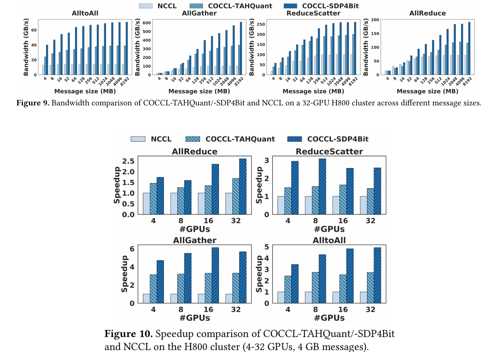
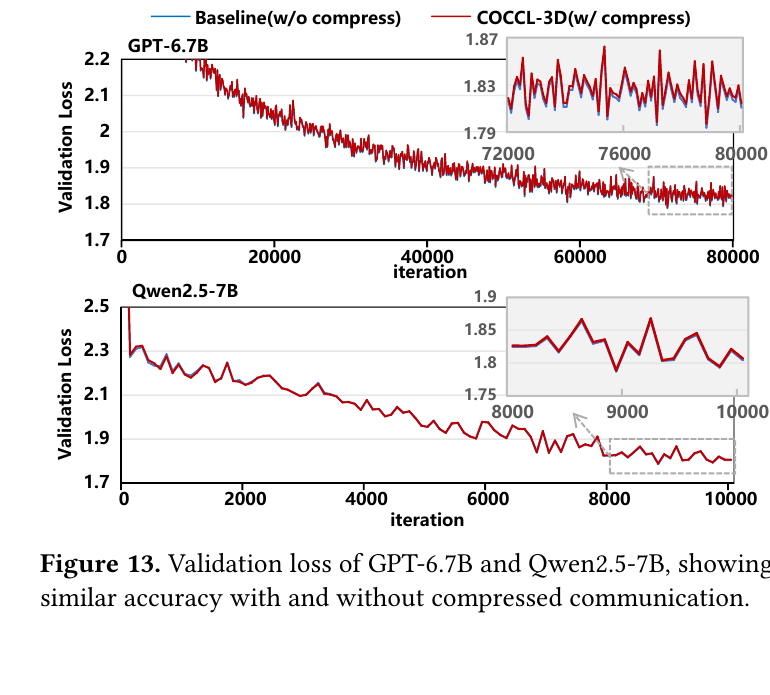

# COCCL

[English](README.md) | 简体中文

COCCL 是一个面向压缩的 GPU 集合通信库，旨在简化定制压缩算法的集成与配置。COCCL 基于 NCCL 2.27.7 构建，在保持 NCCL API 兼容的同时，为 AllGather、ReduceScatter、AllReduce、AllToAll、Send 和 Recv 提供压缩感知的通信流水线。其统一的 C++17 插件模型支持固定布局和分帧变长压缩算子，并默认集成了 [SDP4Bit](https://github.com/ByteDance-Seed/SDP4Bit)、[TACO](src/coccl-extend/extensions/compressor_plugin/taco)、[ZFP](https://github.com/LLNL/zfp) 和 [dietGPU](https://github.com/facebookresearch/dietgpu)。COCCL 还提供流水线重叠、自动算法选择，以及面向数据并行、张量并行和流水线并行通信的训练策略。

例如，使用 SDP4Bit 时，相比 FP32 通信，COCCL 在 AllReduce、ReduceScatter、AllGather 和 AllToAll 上最高分别可获得 2.60 倍、2.58 倍、5.66 倍和 4.92 倍加速。在端到端三维并行训练中，COCCL 在保持模型精度的同时，最高可将训练吞吐提升 1.24 倍。

(C) 2025 中国科学院计算技术研究所。详见项目顶层目录中的 [COPYRIGHT](LICENSE.txt)。

- 开发者：刘星辰、孔昊然、刘嫚、田行健、孙大然、魏征、赵李阳、杨锦武

- 顾问：[陶鼎文](https://www.dingwentao.com/)、[谭光明](https://tanniu.github.io/)、[赵海睿](https://hairui-zhao.github.io/)

## 当前版本

- 后端为 NCCL 2.27.7，发布构建和验收使用 CUDA 12.8。
- 已完成单节点 4 张 A800 和双节点 8 张 A800 的运行时验收。原生
  `sm_90`、`sm_100` 构建已经就绪，Hopper 和 Blackwell 的运行时验收等待对应硬件。
  A800 矩阵覆盖 depth 1/2/4/8、固定布局 SDP4Bit/ZFP 和仅节点间使用的 framed dietGPU。
- Pipeline 通信工作区使用 NCCL registered memory。满足条件的单节点固定布局
  AllGather 和 ReduceScatter stage 会申请 symmetric window，无法使用时自动回退到
  ordinary registration。
- 原生 stage 内部使用 Ring 还是 PAT 仍由 NCCL 选择；COCCL 自动调优只选择压缩通信的
  OneShot、TwoShot 或 TripleShot 上层 recipe。

## 快速开始

### 环境要求

- CUDA 12.8（发布验收工具链）
- 支持 C++17 的主机编译器
- 多进程和多节点测试需要 MPI
- 构建内置 ZFP 和 dietGPU 插件需要 CMake

### 构建

构建 COCCL 库：

```shell
git clone https://github.com/hpdps-group/COCCL.git
chmod 777 -R COCCL
cd COCCL
make -j src.build
```

如果 CUDA 未安装在默认路径 `/usr/local/cuda`，请在构建时指定路径：

```shell
make -j src.build CUDA_HOME=<path to CUDA>
```

默认情况下，COCCL 会为所有支持的 GPU 架构进行编译。若只需构建目标架构，请设置 `NVCC_GENCODE`：

```shell
make -j src.build CUDA_HOME=<path to CUDA> \
  NVCC_GENCODE="-gencode=arch=compute_80,code=sm_80"
```

`src.build` 会构建 COCCL 库和内置压缩器插件。使用手工构建方式时，配置检查器需要单独构建：

```shell
make -f src/coccl-extend/Makefile coccl-config-check \
  BUILDDIR="$PWD/build" NCCLDIR="$PWD" \
  COCCL_ROOT=src/coccl-extend CUDA_HOME=<path to CUDA>
```

清理构建产物：

```shell
make clean
```

自动构建脚本见 [examples/build_scripts](examples/build_scripts/README_zh-CN.md)。

### 构建完成后

除非设置了 `BUILDDIR`，COCCL 默认安装在 `build/`。将应用指向生成的库和头文件：

```shell
export COCCL_ROOT=/path/to/COCCL
export NCCL_HOME=$COCCL_ROOT/build
export LIBRARY_PATH=$NCCL_HOME/lib:${LIBRARY_PATH:-}
export LD_LIBRARY_PATH=$NCCL_HOME/lib:${LD_LIBRARY_PATH:-}
export C_INCLUDE_PATH=$NCCL_HOME/include:${C_INCLUDE_PATH:-}
export CPLUS_INCLUDE_PATH=$NCCL_HOME/include:${CPLUS_INCLUDE_PATH:-}

export COCCL_ENABLE=1
export COCCL_CONFIG_FILE=$COCCL_ROOT/examples/benchmarks_scripts/configs/sdp4bit.toml

$NCCL_HOME/bin/coccl-config-check "$COCCL_CONFIG_FILE"
your_application
```

将 `COCCL_ENABLE` 设为 `0` 或取消该变量，即可使用原生 NCCL。

### 测试

构建 [COCCL 测试](tests/coccl-tests/README_zh-CN.md)：

```shell
cd tests/coccl-tests
make -j MPI=1 MPI_HOME=<path to MPI> CUDA_HOME=<path to CUDA> \
  NCCL_HOME=$NCCL_HOME NVCC_GENCODE="$NVCC_GENCODE"
```

测试二进制文件生成在 `build/` 下。例如：

```shell
./build/alltoall_comp_perf -b 1M -e 1G -f 2 -t <number of GPUs> -g 1
```

项目提供的单节点和多节点测试脚本见 [examples/benchmarks_scripts](examples/benchmarks_scripts/README_zh-CN.md)。

## 集成压缩器

插件 SDK 支持固定长度、分帧变长、有状态以及融合归约压缩器。新插件放在 `src/coccl-extend/extensions/compressor_plugin/` 下，流水线与集合通信调度由 COCCL 负责。

当前 Compressor ABI 为 v9，从旧版 COCCL 升级时需要重新编译外部插件。用户可修改的通信 recipe、插件和配置位于 `src/coccl-extend/extensions/`；调度、内存、压缩运行时、自动调优和训练分类位于 `src/coccl-extend/core/`。

SDK 约定、最小适配器、构建规则、验证方法和 Codex 集成 skill 见[压缩器集成指南](src/coccl-extend/extensions/compressor_plugin/README_zh-CN.md)。

## 配置

可以从仓库中的 TOML 文件开始配置：

- [normal-mixed.toml](src/coccl-extend/extensions/configs/normal-mixed.toml)：在 normal 模式中同时使用 ZFP 和 SDP4Bit；
- [training.toml](examples/training_scripts/configs/training.toml)：使用 SDP4Bit 和自动调优的 training 模式；
- [benchmark 配置](examples/benchmarks_scripts/configs)：每个内置压缩器对应一份配置。

运行前验证配置文件：

```bash
build/bin/coccl-config-check path/to/config.toml
```

### 运行时设置

- `runtime.mode`：`normal` 或 `training`。
- `runtime.compression_threshold_bytes`：自动启用压缩的最小逻辑消息大小，默认为 8 MiB。
- `compressor_plugins.compressors`：当前配置文件使用的插件名称。
- `compressor_plugins.library_path`：包含 `lib<name>.so` 的目录。相对路径以 TOML 文件所在目录为基准解析。
- `pipeline.depth`：可设为 1 到 16 的整数或 `"auto"`。Auto 模式根据
  pipeline graph 和消息大小选择不超过 16 的 2 的幂次 depth。

可以使用 `normal.<operation>.threshold_bytes`、`training.{dp,tp}.<operation>.threshold_bytes` 或 `training.pp.sendrecv.{forward,backward}.threshold_bytes` 覆盖全局阈值。

如果选中的压缩器不支持当前操作、数据类型或 shape，标准 NCCL 调用会回退到原生 NCCL。显式 `coccl*Comp*` 调用会跳过消息大小阈值，但仍要求存在匹配的策略。

生成的 `nccl.h` 提供以下显式接口，用于测试、直接调用压缩路径或手动选择算法：

- `cocclAllGatherComp`、`cocclAllGatherCompTwoShot` 和
  `cocclAllToAllComp`；
- `cocclReduceScatterCompOneShot` 和 `cocclReduceScatterCompTwoShot`；
- `cocclAllReduceCompOneShot`、`cocclAllReduceCompTwoShot` 和
  `cocclAllReduceCompTripleShot`；
- `cocclSendComp` 和 `cocclRecvDecomp`。

压缩 Send/Recv 以完整消息为单位串行执行。Grouped 调用会批量提交 metadata 和 payload 交换，使流水线并行流量可以共用固定布局或 framed 协议，而不创建按方向区分的额外 stream。

### Normal 模式

Normal 模式按照通信操作选择策略：

```text
normal.all_gather
normal.reduce_scatter
normal.all_reduce
normal.all_to_all
normal.sendrecv
```

每个操作可以定义：

- `default`：平坦通信和默认策略；
- `intra`：节点内阶段；
- `inter`：节点间阶段。

显式配置的 `intra` 或 `inter` 会覆盖 `default`。设置 `enabled = false` 可使对应范围使用原生 NCCL。

每个 scope 只描述该 scope 输出的编码。对于层次化归约，COCCL 会携带上一个 scope 的 compressor descriptor 用于解码，并使用当前 scope 的配置重新压缩。因此 `inter` 配置无需重复填写 `intra` 的输入参数。

下面的示例同时加载两个压缩器，并分别分配给两个通信操作：

```toml
[runtime]
mode = "normal"
compression_threshold_bytes = 1048576

[compressor_plugins]
compressors = ["zfp", "sdp4bit"]
library_path = "/path/to/COCCL/build/obj/coccl-extend/compressor_plugin/libcompress"

[normal.all_reduce.default]
compressor = "zfp"

[normal.all_reduce.default.config]
rate = 8

[normal.reduce_scatter.default]
compressor = "sdp4bit"

[normal.reduce_scatter.default.config]
groupCount = 128
quantBits = 4
quantType = "Symmetric"
hadamard = true
```

### Training 模式

Training 模式按照并行角色路由通信：

```text
training.dp.{all_gather,reduce_scatter,all_reduce}
training.tp.{all_gather,reduce_scatter,all_reduce}
training.pp.sendrecv.{forward,backward}
```

在 `training.classifier` 中声明训练框架的拓扑：

- `data_parallel_size`、`tensor_parallel_size` 和 `pipeline_parallel_size` 必须与任务一致；
- `dp_strategy` 可设为 `ddp`、`sdp` 或 `fsdp`；
- 当 TP 使用 ReduceScatter 和 AllGather 而不是 AllReduce 时，设置 `sequence_parallel = true`。

COCCL 会优先使用 communicator 大小进行判断；唯一匹配已配置并行度的 communicator 会立即完成分类。当 DP 和 TP 存在歧义时，COCCL 会观察不小于 1 MiB 的重复集合通信模式。歧义流量在观察阶段保持使用原生 NCCL，并在该 communicator 的角色确定后统一切换。`training.observation_iterations` 默认为 5。

最小配置示例：

```toml
[runtime]
mode = "training"

[training]
observation_iterations = 5

[compressor_plugins]
compressors = ["sdp4bit"]
library_path = "/path/to/COCCL/build/obj/coccl-extend/compressor_plugin/libcompress"

[training.classifier]
data_parallel_size = 4
tensor_parallel_size = 2
pipeline_parallel_size = 1
dp_strategy = "sdp"
sequence_parallel = false

[training.dp.reduce_scatter.default]
compressor = "sdp4bit"

[training.dp.reduce_scatter.default.config]
groupCount = 128
quantBits = 4
quantType = "Symmetric"

[autotune]
enabled = true
all_gather_algorithm = "auto"
reduce_scatter_algorithm = "auto"
all_reduce_algorithm = "auto"
```

基于 NVIDIA Megatron-LM 的 Qwen3 示例位于 [examples/training_scripts](examples/training_scripts/README_zh-CN.md)。

### 自动调优

自动调优用于选择 AllGather、ReduceScatter 和 AllReduce 算法以及
pipeline slice 大小：

- `autotune.enabled`：启用性能采样和基于模型的算法选择，默认为 `true`。
- `profile_min_bytes`、`profile_max_bytes`：性能采样范围，默认从 256 KiB 到 8 GiB，并受可用 GPU 显存限制。
- `warmup`、`iterations`：每个采样点的预热与迭代次数，默认分别为 3 和 10。
- `all_gather_algorithm`：`auto`、`oneshot` 或 `twoshot`。OneShot 使用一次
  平坦 AllGather；TwoShot 先进行节点间 AllGather，再进行节点内 AllGather，
  要求多节点拓扑中每个节点的 Rank 数相同。
- `reduce_scatter_algorithm`：`auto`、`oneshot` 或 `twoshot`。
- `all_reduce_algorithm`：`auto`、`oneshot`、`twoshot` 或 `tripleshot`。

如果模型不可用，COCCL 会使用内置启发式规则。性能采样按进程惰性执行并共享模型；模型只比较 COCCL 的通信 recipe，每个原生 stage 内部的 transport 算法仍由 NCCL 选择。

### 日志

COCCL 使用 NCCL 日志系统：

```bash
export NCCL_DEBUG=INFO
export NCCL_DEBUG_SUBSYS=COCCL_TUNING
```

可用子系统：

- `COCCL`：全部 COCCL 日志；
- `COCCL_INIT`：配置与初始化；
- `COCCL_RUNTIME`：策略路由；
- `COCCL_PIPELINE`：流水线执行；
- `COCCL_COMPRESS`：压缩器调用与资源；
- `COCCL_MEMORY`：工作区分配；
- `COCCL_TUNING`：自动调优与训练通信分类。

## 更多示例

- [构建](examples/build_scripts/README_zh-CN.md)
- [通信性能测试](examples/benchmarks_scripts/README_zh-CN.md)
- [Qwen 训练](examples/training_scripts/README_zh-CN.md)
- [COCCL 测试](tests/coccl-tests/README_zh-CN.md)

## 性能

以下已发表结果使用 32 张 H800 GPU、CUDA 12.6、NCCL 2.21.5 和 InfiniBand，作为论文基线保留。当前 NCCL 2.27.7 版本另行完成了单节点和双节点 A800 回归验收。相比 FP32 NCCL，COCCL-SDP4Bit 在 AllReduce、ReduceScatter、AllGather 和 AllToAll 上最高分别可获得 2.60 倍、2.58 倍、5.66 倍和 4.92 倍加速。



端到端训练在保持验证集损失的同时提高了吞吐：

<p align="center">
  
</p>

<div align="center">
  <table>
    <thead>
      <tr>
        <th align="left">模型</th>
        <th align="right">参数规模</th>
        <th align="right">NCCL TFLOPS</th>
        <th align="right">COCCL TFLOPS</th>
        <th align="right">加速比</th>
      </tr>
    </thead>
    <tbody>
      <tr>
        <td>GPT</td>
        <td align="right">2.7B</td>
        <td align="right">88.5</td>
        <td align="right">94.5</td>
        <td align="right">1.06x</td>
      </tr>
      <tr>
        <td>GPT</td>
        <td align="right">6.7B</td>
        <td align="right">148.6</td>
        <td align="right">163.2</td>
        <td align="right">1.10x</td>
      </tr>
      <tr>
        <td>GPT</td>
        <td align="right">13B</td>
        <td align="right">158.8</td>
        <td align="right">197.1</td>
        <td align="right">1.24x</td>
      </tr>
      <tr>
        <td>Qwen2.5</td>
        <td align="right">7B</td>
        <td align="right">222.3</td>
        <td align="right">234.2</td>
        <td align="right">1.05x</td>
      </tr>
    </tbody>
  </table>
</div>

## 引用

```bibtex
@inproceedings{liu2026coccl,
  title={COCCL: A Collective Communication Library Supporting Easy Integration and Configuration of Customized Compression for Scalable LLM Training},
  author={Liu, Xingchen and Kong, Haoran and Zhao, Hairui and Lyu, Shengkai and Wei, Zheng and Liu, Man and Tian, Xingjian and Zhao, Liyang and Chen, Zhuohan and Wang, Fakang and others},
  booktitle={Proceedings of the 31st ACM SIGPLAN Annual Symposium on Principles and Practice of Parallel Programming},
  pages={384--397},
  year={2026}
}
@misc{liu2026taco,
  title={TACO: Efficient Communication Compression of Intermediate Tensors for Scalable Tensor-Parallel LLM Training},
  author={Man Liu and Xingchen Liu and Xingjian Tian and Bing Lu and Shengkay Lyu and Shengquan Yin and Wenjing Huang and Zheng Wei and Hairui Zhao and Guangming Tan and Dingwen Tao},
  year={2026},
  eprint={2604.24088},
  archivePrefix={arXiv},
  primaryClass={cs.DC},
  url={https://arxiv.org/abs/2604.24088}
}
```
