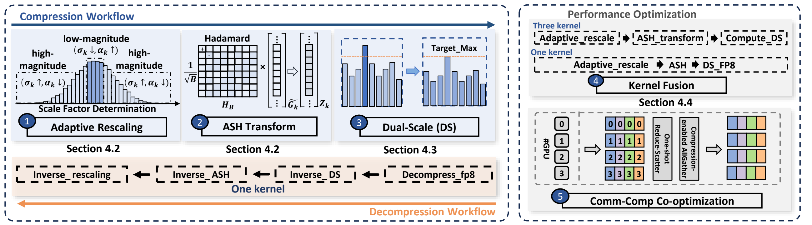
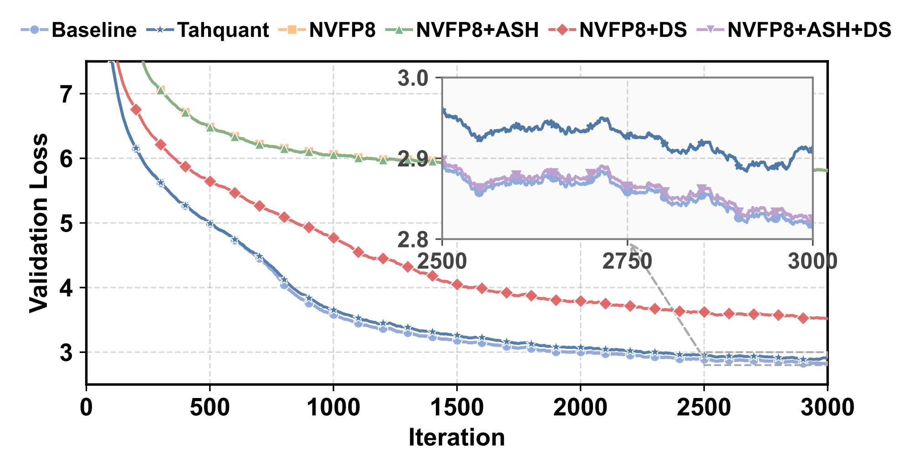
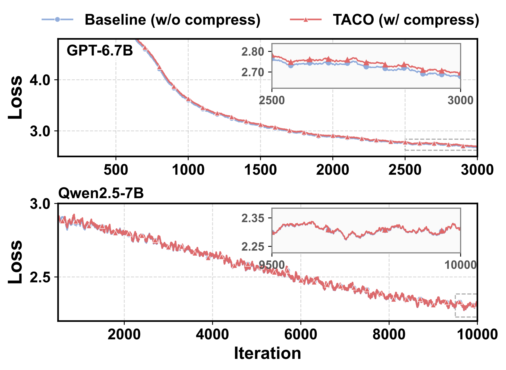

# TACO

TACO is an FP8 communication compressor for tensor-parallel large-language
model training. This directory contains its COCCL adapter and CUDA kernels.
General ABI, build, and integration requirements are documented in the
[compressor plugin guide](../README.md).

---

## 📌 Overview

Communication overhead is a critical bottleneck in large-scale tensor-parallel training, especially due to the **dense and near-zero distributions** of intermediate tensors.

To address this, we propose **TACO (Tensor-parallel Adaptive COmmunication compression)**:

* FP8-based compression for intermediate tensors
* Adaptive Scale + Hadamard Transform for high-fidelity quantization
* Dual-scale quantization for numerical stability
* Fused compression kernels for low overhead
* Seamless integration with TP + PP + DP (3D parallelism)

### 🚀 Performance

* Up to **1.87× end-to-end training speedup**
* **Near-lossless accuracy**

---

## 🖼️ Framework Overview



---

## 🧩 TACO Compression Operator

Source directory:

```bash
src/coccl-extend/extensions/compressor_plugin/taco
```

### 🔧 Compile Operator Only

```bash
cd src/coccl-extend/extensions/compressor_plugin/taco
make
```

---

## ⚙️ Compression Configuration

TACO accepts `fp8Format = "E4M3"|"E5M2"`, `saturate = true|false`,
`groupSize = 32|64|128|256|512`, `targetRange`, `lambda`, and an optional
positive `fp8MaxValue`. A value of `0.0` for `fp8MaxValue` uses the selected
format's default.

```toml
[training.tp.all_reduce.default]
compressor = "taco"

[training.tp.all_reduce.default.config]
fp8Format = "E4M3"
saturate = true
groupSize = 128
targetRange = 448.0
lambda = 1e-6
```

---

## 📊 Ablation Results

| Method   | Val Loss ↓ | Test Loss ↓ | Val Deg. ↓ | Test Deg. ↓ |
| -------- | ---------- | ----------- | ---------- | ----------- |
| Baseline | 2.389899   | 2.344701    | –          | –           |
| **TACO** | 2.395784   | 2.351210    | **+0.25%** | **+0.28%**  |

---




## 📈 Comparison Results



---


---

## 📎 Notes

* Designed for large-scale distributed training (Megatron-LM based)
* Supports integration with existing TP/PP/DP pipelines
* Requires CUDA + NCCL + MPI environment
* Achieves better performance under high tensor parallelism (TP ≥ 4)

---

## 📖 Citation

```bibtex
@misc{liu2026taco,
  title={TACO: Efficient Communication Compression of Intermediate Tensors for Scalable Tensor-Parallel LLM Training},
  author={Man Liu and Xingchen Liu and Xingjian Tian and Bing Lu and Shengkay Lyu and Shengquan Yin and Wenjing Huang and Zheng Wei and Hairui Zhao and Guangming Tan and Dingwen Tao},
  year={2026},
  eprint={2604.24088},
  archivePrefix={arXiv},
  primaryClass={cs.DC},
  url={https://arxiv.org/abs/2604.24088}
}
```

> 🔗 arXiv: https://arxiv.org/abs/2604.24088
> 📌 HPDC version will be updated once available.
